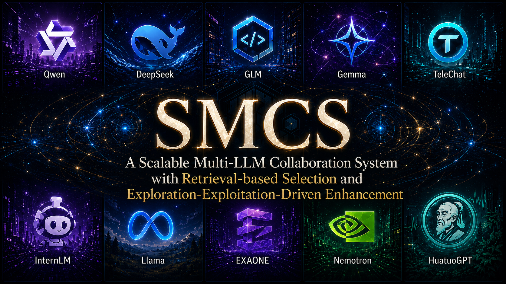
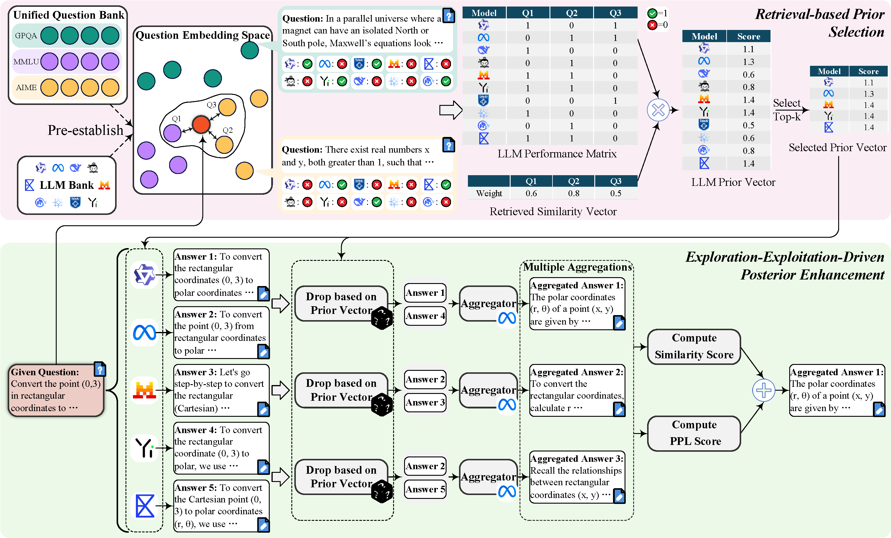
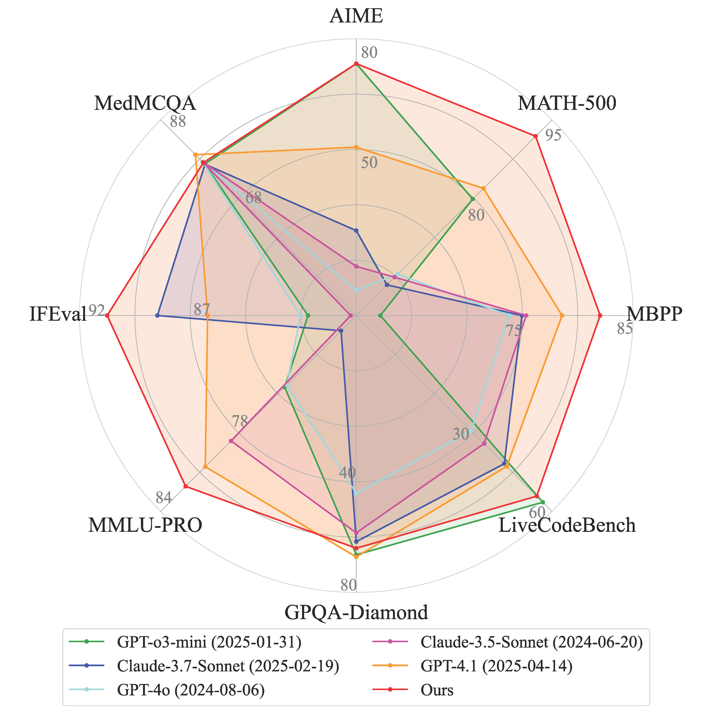
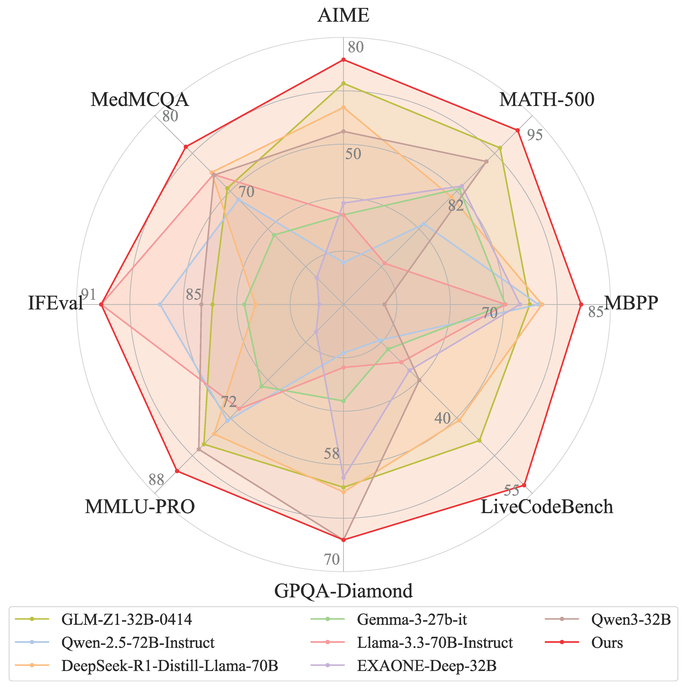

<h1 align="center">SMCS: A Scalable Multi-LLM Collaboration System with Retrieval-based Selection and Exploration-Exploitation-Driven Enhancement</h1>
<p align="center">
  
</p>
A multi-LLM collaboration framework that **selects the suitable LLMs for each question, explores multiple aggregation candidates, and chooses the best final response.**
<p align="center">
  <a href="https://github.com/magent4aci/SMCS"></a>
  <a href="https://arxiv.org/pdf/2507.14200?"></a>
  <a href="https://huggingface.co/datasets/aisfuture/smcs_data"></a>
  <a href="./LICENSE"></a>
</p>

# 📰News</h1>

- [2026/05/20] 🌟 The open-source engineering version of SMCS was cleaned up!
- [2026/04/04] 🏆 SMCS is accepted in the ACL 2026 main conference!

* * *

# 📓Introduction

SMCS is the official open-source implementation of the paper **"A Scalable Multi-LLM Collaboration System with Retrieval-based Selection and Exploration-Exploitation-Driven Enhancement"**.

Recent large language models have become strong general-purpose reasoners, but no single model is uniformly best across all tasks. As more heterogeneous open-source LLMs become available, an important research question emerges: **how can we scale collaboration among many LLMs so that the whole system becomes stronger than any single model, while still remaining extensible as new models and new tasks appear?**

Existing multi-LLM collaboration systems usually improve quality from one of two directions:

- **prior selection**, which chooses promising models before response generation
- **posterior enhancement**, which compares candidate responses after generation

Both directions are useful, but both also have scaling limitations. Prior-based systems often depend on router training, coarse capability labels, or fixed categories that are hard to update when new LLMs are added. Posterior-based systems often rely on a fixed response pool, a static model set, or a single selection signal such as voting or perplexity, which can bias the final choice and limit output diversity. The paper argues that these two stages should not be treated in isolation: weak prior selection introduces low-quality references, while weak posterior selection wastes the value of diverse responses.

To address this, SMCS turns a pool of heterogeneous open-source LLMs into a coordinated collaboration system that can:

- retrieve similar questions from a unified question bank
- estimate which LLMs are most suitable for the current input
- generate multiple aggregation candidates from different reference subsets
- select the strongest final answer with a hybrid posterior score

The framework is built around two tightly connected components:

- **RPS: Retrieval-based Prior Selection**
- **EPE: Exploration-Exploitation-Driven Posterior Enhancement**

In **RPS**, SMCS first builds a unified multi-domain question bank and evaluates each candidate LLM on it, producing a fine-grained historical capability profile. At test time, instead of routing through a coarse classifier, SMCS retrieves questions that are semantically similar to the current input and uses the retrieved performance evidence to compute weighted prior scores for each LLM. This makes model selection instance-level, adaptive, and easier to scale as the model pool grows.

In **EPE**, SMCS does not stop after selecting a single reference set. It treats aggregation as an exploration-exploitation problem: references are dropped according to their prior distribution to form multiple subsets, the aggregator produces multiple candidate answers, and then these candidates are ranked with a hybrid posterior score. In the paper, this hybrid score combines inter-response and intra-response information. In this repository, the open-source implementation follows that direction by using response-level embedding similarity together with PPL-derived confidence, while keeping the scoring direction explicit: **lower PPL leads to a higher score**.



This design gives SMCS two advantages at once: it can continuously absorb new open-source LLMs without rebuilding the whole system from scratch, and it can search a larger answer space than fixed-agent or one-shot aggregation methods.

SMCS built on **15 open-source LLMs** surpasses strong closed-source baselines such as **GPT-4.1 (+5.36%)** and **GPT-o3-mini (+5.28%)** across eight mainstream benchmarks, while also exceeding the average best open-source result by **+2.86%**.

The broader message of the paper is not only that SMCS improves benchmark scores, but that **open-source LLM collaboration can be systematically scaled**. Rather than viewing model diversity as a deployment burden, SMCS treats it as a resource: historical performance becomes retrievable prior knowledge, and diverse candidate responses become exploitable posterior evidence.

* * *

## 🌟Highlights

- **Scalable model expansion**: new LLMs can be integrated by black-box evaluation on the unified question bank, without retraining a monolithic router.
- **Instance-level routing**: model selection is performed per question, rather than with one static expert subset for all tasks.
- **Exploration before commitment**: SMCS does not stop at one aggregated answer; it explores multiple aggregation candidates from different reference subsets.
- **Hybrid posterior scoring**: candidate selection uses both inter-response agreement and intra-response confidence signals.
- **Research-friendly engineering**: this repository has been refactored to be more auditable, configurable, and reproducible in Linux-first research environments.

<p align="center">
  
  
</p>

* * *

## 📁Released Components

This repository currently releases the engineering code needed to reproduce and extend the SMCS pipeline.

| Component | Path | Purpose |
| --- | --- | --- |
| Main experiment entry | [run_exp.py](./run_exp.py) | Unified entry for dataset-specific SMCS runs |
| Core collaboration logic | [global_utils/moa_classes.py](./global_utils/moa_classes.py) | Shared RPS/EPE orchestration logic |
| Runtime configuration | [smcs_config.example.json](./smcs_config.example.json) | Template for endpoint, path, and question-bank setup |
| LLM API server | [llm_api](./llm_api) | FastAPI / batch inference serving utilities |
| Benchmark adapters | [benchmarks](./benchmarks) | Dataset-specific evaluation adapters for `AIME`, `GPQA`, `IFEval`, `LiveCodeBench`, `MATH`, `MBPP`, `MedMCQA`, `MMLU-PRO`, `FinQA`, `HumanEval`, and `LiveMathBench` |
| Question-bank merger | [build_union_question_bank.py](./build_union_question_bank.py) | Merge per-dataset banks into a unified bank |

* * *

# 🚀Getting Started

## Installation

We recommend Python 3.10 with CUDA 12+ and a recent `vllm` release.

```bash
conda create -n smcs python=3.10
conda activate smcs
pip install -r requirements.txt
```

If you plan to use local embedding-model loading, make sure the corresponding model weights are already available on disk.

## Configuration

Runtime configuration is externalized. You do **not** need to manually edit hard-coded endpoint dictionaries inside the source code.

1. Create `smcs_config.json` in the repo root, or set `SMCS_CONFIG_PATH` to another JSON file.
2. Start from [smcs_config.example.json](./smcs_config.example.json).
3. Fill only the sections needed for your setup.

Supported top-level sections:

- `model_configs`
- `embedding_model_configs`
- `question_banks`
- `embedding_model_paths`

Minimal example:

```json
{
  "model_configs": {
    "Meta-Llama-3.3-70B-Instruct": {
      "type": "fastapi",
      "ip": "10.0.0.12",
      "port": "6006"
    }
  },
  "embedding_model_configs": {
    "Linq-Embed-Mistral": {
      "type": "fastapi",
      "ip": "10.0.0.13",
      "port": "6006"
    }
  },
  "question_banks": {
    "8d": "/path/to/question_bank_8d.json"
  }
}
```

## LLM API backends

SMCS now keeps only two model-call formats in `model_configs`. The old experimental `api`, `post`, `eas`, and `filesystem` config types are intentionally removed from the main runtime path to keep deployment predictable.

| Type | Use case | Required fields | Response format |
| --- | --- | --- | --- |
| `fastapi` | Local or cluster-hosted SMCS/vLLM service started by `llm_api/api_online_batch.py` or `llm_api/api_online.py`. | `ip`, `port` | The local service returns a JSON list such as `[{"response": "..."}]`. When logprobs are requested, it should include `mean_logprob` or `cumulative_logprob`. |
| `openai` | Any OpenAI-compatible chat-completions endpoint, including official OpenAI APIs and third-party gateways that implement `/chat/completions`. | `model_name`; either `api_key`, `api_keys`, or `api_key_env`; optional `base_url` | The runtime calls `client.chat.completions.create(...)` through the OpenAI Python SDK and reads `choices[0].message.content`. |

Local FastAPI example:

```json
{
  "model_configs": {
    "Meta-Llama-3.3-70B-Instruct": {
      "type": "fastapi",
      "ip": "127.0.0.1",
      "port": "6006"
    }
  }
}
```

OpenAI-compatible example:

```json
{
  "model_configs": {
    "gpt-4.1": {
      "type": "openai",
      "model_name": "gpt-4.1",
      "api_key_env": "OPENAI_API_KEY"
    },
    "my-openai-compatible-model": {
      "type": "openai",
      "model_name": "served-model-name",
      "base_url": "http://127.0.0.1:8000/v1",
      "api_key": "EMPTY"
    }
  }
}
```

Notes:

- For `fastapi`, the server may bind to `0.0.0.0`, but `smcs_config.json` must use a reachable client address such as `127.0.0.1`, a hostname, or a LAN IP.
- `embedding_model_configs` currently use the local `fastapi` backend only, because SMCS relies on the project embedding service for question retrieval and response similarity scoring.
- The PPL-derived posterior score works best with the local FastAPI backend, which returns token logprob summaries. OpenAI-compatible endpoints can be used for normal generation; if the provider does not return chat logprobs, SMCS will fall back to response-level scoring for that call.

## Use released SMCS data

We also release prebuilt SMCS data on Hugging Face: [aisfuture/smcs_data](https://huggingface.co/datasets/aisfuture/smcs_data). This is the recommended startup path if you want to run SMCS without rebuilding every reference-model cache and the union question bank from scratch.

The released dataset currently has this structure:

```text
smcs_data/
  question_bank/
    union_question_bank_8d.json
  cache_8k/
    AIME/result/single_agent_8k/<Model>/{result.json,summary.json}
    GPQA/result/single_agent_8k/<Model>/{result.json,summary.json}
    IFEval/result/single_agent_8k/<Model>/{result.json,result_cache.json,eval_results_*.jsonl,summary.json}
    LiveCodeBench/result/single_agent_8k/<Model>/{result.json,result_cache.json,result_eval_all.json,summary.json}
    MATH/result/single_agent_8k/<Model>/{result.json,summary.json}
    MBPP/result/single_agent_8k/<Model>/{results.jsonl,eval_acc.jsonl}
    MedMCQA/result/single_agent_8k/<Model>/{result.json,summary.json}
    MMLU-PRO/result/single_agent_8k/<Model>/<subject>_{result,summary}.json
```

Download it into a local data directory:

```bash
pip install -U huggingface_hub
huggingface-cli download aisfuture/smcs_data \
  --repo-type dataset \
  --local-dir data/smcs_data
```

Then make the released reference caches visible to the benchmark adapters:

```bash
cp -r data/smcs_data/cache_8k/* benchmarks/
```

Finally, point the `8d` question-bank alias in `smcs_config.json` to the released union bank:

```json
{
  "question_banks": {
    "8d": "data/smcs_data/question_bank/union_question_bank_8d.json"
  }
}
```

With this setup, you can skip Step 3 and Step 4 below for the released datasets and models. You still need the embedding service for retrieval and response-level scoring, and you still need an aggregator LLM endpoint for `--model`.

## Dataset-specific preparation

Most QA and math benchmarks can follow the generic pipeline once model endpoints, embedding endpoints, and question-bank paths are configured. A few benchmarks need local dataset assets or evaluator resources before they can be used with `python -m run_exp`. This still applies when you use the released SMCS caches, because the final run must load the target dataset and may execute the benchmark evaluator for newly aggregated answers.

| Dataset | Required preparation | Why it is needed |
| --- | --- | --- |
| `MBPP` | Make sure the Hugging Face dataset `google-research-datasets/mbpp` is reachable or already present in the local Hugging Face cache. Also run MBPP in an environment where generated Python code can be executed with timeouts. | The MBPP builders and evaluator load the dataset through `datasets.load_dataset(...)`, then execute generated code to compute correctness. A machine without dataset access/cache or without code-execution permission will fail before SMCS aggregation starts. |
| `IFEval` | Keep the local files under `benchmarks/IFEval/dataset/`, install the evaluator extras with `pip install -r benchmarks/IFEval/instruction_following_eval/requirements.txt`, and make sure NLTK `punkt` and `punkt_tab` data are available under `benchmarks/IFEval/nltk_data/`. | IFEval uses the bundled instruction-following evaluator for strict rule checks. The evaluator depends on `nltk`, `langdetect`, `immutabledict`, and local tokenizer data. The question-bank builder downloads the NLTK data when online; offline machines should pre-seed that directory. |
| `LiveCodeBench` | Download the benchmark snapshot before running builders or SMCS: `cd benchmarks/LiveCodeBench && python download.py`. This creates `benchmarks/LiveCodeBench/dataset/LiveCodeBench_dataset/`. Run it in an environment where generated Python code can be compiled and executed with timeouts. | The LiveCodeBench adapter intentionally loads the dataset from disk with `load_from_disk(...)`. If the snapshot is missing, it raises a `FileNotFoundError`. Correctness is also computed by executing generated code against public and private tests. |

Useful one-time setup commands:

```bash
# MBPP: populate the Hugging Face cache used by the builders.
python -c "from datasets import load_dataset; load_dataset('google-research-datasets/mbpp')"

# IFEval: install evaluator extras and pre-download tokenizer data.
pip install -r benchmarks/IFEval/instruction_following_eval/requirements.txt
python -c "import nltk; nltk.download('punkt', download_dir='benchmarks/IFEval/nltk_data'); nltk.download('punkt_tab', download_dir='benchmarks/IFEval/nltk_data')"

# LiveCodeBench: materialize the local release_v6 snapshot.
cd benchmarks/LiveCodeBench
python download.py
cd ../..
```

If you are building question banks and reference caches yourself, use the standard commands after these dataset-specific assets are ready:

```bash
cd benchmarks/<Dataset>
python -m build_single_question_bank --model <ReferenceModel> --max_tokens 8192
python -m build_reference_cache --model <ReferenceModel> --max_tokens 8192
```

* * *

# 🎯Evaluation Pipeline
There are five steps to start the standard SMCS workflow from scratch:

## 1. Start the embedding model server

```bash
python -m llm_api.api_em_online --model_name=Linq-Embed-Mistral
```

This service is used for:

- question-bank retrieval in RPS
- response-level similarity scoring in EPE

## 2. Start the LLM API

Recommended:

```bash
python -m llm_api.api_online_batch --model_name_or_path=/path/to/your/model
```

Notes:

- the server binds to `0.0.0.0`, but client configuration should point to a **reachable host or IP**
- in practical 70B-scale settings, the main LLM API usually needs multiple GPUs
- if `--model` is configured with `type: "openai"`, skip this local server step and make sure `model_configs` contains the correct `model_name`, `base_url` if needed, and API key setting

## 3. Build the question bank

Skip this step if you use the released `question_bank/union_question_bank_8d.json` from [aisfuture/smcs_data](https://huggingface.co/datasets/aisfuture/smcs_data) and configure it in `smcs_config.json`.

Run the dataset-specific question-bank builder for each reference model you want included in the bank. InD benchmarks use the same entry filename and write to `benchmarks/<Dataset>/result/question_bank_8k/<model>/`.

Example:

```bash
cd benchmarks/<Dataset>
python -m build_single_question_bank --model QwQ-32B --max_tokens 8192
```

For the current InD set, this applies to `AIME`, `GPQA`, `IFEval`, `LiveCodeBench`, `MATH`, `MBPP`, `MedMCQA`, and `MMLU-PRO`. These builders use benchmark-local train/question-bank splits rather than the target test split. GPQA and MedMCQA additionally validate non-overlap in code; LiveCodeBench uses the pre-2024-08-01 slice for the question bank and the 2024-08-01 to 2025-02-01 slice for the reference/test cache.

After the per-dataset banks are prepared, merge them:

```bash
python -m build_union_question_bank --model_list 15_large
```

Useful options include `--datasets`, `--models`, `--result_exp`, `--output`, and `--dry_run`. The merger validates that every selected question has results from every selected model before writing the final bank.

## 4. Build the reference cache

Skip this step if you copied the released `cache_8k/*` directories into `benchmarks/`.

Reference caches are separate from question banks. They contain each reference model's response to the target test split and are read by SMCS from `benchmarks/<Dataset>/result/single_agent_8k/<model>/`.

Use the matching benchmark-local cache builder:

```bash
cd benchmarks/<Dataset>
python -m build_reference_cache --model QwQ-32B --max_tokens 8192
```

The file names are intentionally parallel: `build_single_question_bank.py` is for retrieval/question-bank evidence, while `build_reference_cache.py` is for test-time reference responses.

## 5. Run SMCS

Recommended command are as followed. It is also observed that `--model rag_moa_weighted_3` is better for coding tasks such as MBPP and LiveCodeBench:

```bash
python -m run_exp \
  --model Meta-Llama-3.3-70B-Instruct \
  --dataset MMLU-PRO \
  --max_tokens 8192 \
  --agg_max_tokens 8192 \
  --model_list 15_large \
  --use_sc \
  --ref_sample prior_6 \
  --mode rag_moa_weighted_7 \
  --ppl_coef 1.0 \
  --question_bank 8d
```

If you want to bypass the alias map and directly specify the question-bank file:

```bash
python -m run_exp \
  --model Meta-Llama-3.3-70B-Instruct \
  --dataset MMLU-PRO \
  --mode rag_moa_weighted_7 \
  --question_bank_path /path/to/question_bank_8d.json
```

## Supported datasets

| Dataset | InD/OOD | Task type |
| --- | --- | --- |
| AIME | InD | Mathematical reasoning |
| GPQA | InD | Graduate-level science QA |
| IFEval | InD | Instruction following |
| LiveCodeBench | InD | Code generation and execution |
| MATH | InD | Mathematical reasoning |
| MBPP | InD | Code generation |
| MedMCQA | InD | Medical multiple-choice QA |
| MMLU-PRO | InD | Multi-domain knowledge and reasoning |
| FinQA | OOD | Financial numerical reasoning |
| HumanEval | OOD | Code generation |
| LiveMathBench | OOD | Mathematical reasoning |

## Important arguments

| Argument | Meaning |
| --- | --- |
| `--model` | Aggregator model |
| `--dataset` | Target benchmark |
| `--max_tokens` | Max new tokens for reference models |
| `--agg_max_tokens` | Max new tokens for the aggregator |
| `--model_list` | Reference model pool alias |
| `--use_sc` | Enable posterior self-consistency scoring |
| `--ref_sample` | Exploration mode for reference subset sampling |
| `--mode` | Collaboration mode such as `raw_moa`, `rag_moa_7`, or `rag_moa_weighted_7` |
| `--ppl_coef` | Weight applied to the PPL-derived posterior term |
| `--question_bank` | Config alias for a question-bank file |
| `--question_bank_path` | Explicit question-bank file override |
| `--k` | Retrieval top-k bound used in RPS |

* * *

# 🔧Extending SMCS with Your Own Models and Tasks

SMCS is a scalable method which means you can add new models and tasks easily. New models should look identical to existing models from the caller's perspective, and new tasks should expose the same benchmark-local files and `MoaBase` interface as the built-in datasets.

## Add a new model

1. Serve the model through one supported backend. The maintained config types are `fastapi` for the local SMCS/vLLM service and `openai` for OpenAI-compatible chat-completions endpoints.
2. Add the model to `smcs_config.json` under `model_configs`. The key must be the exact model name you will pass to `--model`, `--models`, or the question-bank builders.
3. If the model should be part of a reusable reference pool, add it to an alias in `global_utils/common_config.py`, for example `15_large` or a new alias such as `my_4_models`.
4. Build its benchmark-local question-bank outputs and reference caches with the standard commands:

```bash
cd benchmarks/<Dataset>
python -m build_single_question_bank --model <YourModelName> --max_tokens <YourMaxTokens>
python -m build_reference_cache --model <YourModelName> --max_tokens <YourMaxTokens>
```

5. Rebuild the union question bank with either a model-list alias or explicit model names:

```bash
python -m build_union_question_bank --model_list my_4_models
python -m build_union_question_bank --models ModelA,ModelB,ModelC,ModelD
```

## Add a new task or dataset

1. Create `benchmarks/<Dataset>/run_exp.py` and define a `Moa<Dataset>` class that inherits `MoaBase`. Implement the dataset-specific methods for loading data, building messages, extracting answers, loading reference caches, and writing result/summary files.
2. Keep `data_path` benchmark-local, for example `./dataset/test.jsonl`, and rely on the root `run_exp.py` loader to resolve it under `benchmarks/<Dataset>/`.
3. Add the public dataset name to the root `run_exp.py --dataset` choices. If the public name contains characters that cannot appear in a Python class name, add an explicit mapping in `run_exp.py` like the current `MMLU-PRO -> MoaMMLU` convention.
4. For an InD task that should contribute retrieval evidence, add `build_single_question_bank.py` and `build_reference_cache.py` under the benchmark directory. The question-bank builder should write `result/question_bank_8k/<model>/...`; the reference-cache builder should write `result/single_agent_8k/<model>/...`.
5. For non-MMLU datasets, the question-bank result file consumed by `build_union_question_bank.py` should be JSONL at `result/question_bank_8k/<model>/result.json`, with at least `question_id`, `question`, and either `is_correct` or `pred` plus `answer`. For MMLU-style subject files, write JSON arrays named `<subject>_result.json`.
6. Include the new dataset when merging the union bank by passing `--datasets ExistingDataset,YourDataset`, or update the default dataset list in `build_union_question_bank.py` if it should become part of the standard InD bank.

Before running a full experiment, use cheap checks first:

```bash
python -m run_exp --help
python -m build_union_question_bank --datasets YourDataset --models ModelA,ModelB --dry_run
```

# 🔔Acknowledgement

We thank the open-source ecosystem that makes this project possible, including projects and libraries around:

- vLLM
- FastAPI
- Hugging Face Transformers
- ModelScope
- PyTorch
- benchmark and dataset tooling used throughout the repo

* * *

# Citation

If you find this repository useful, please cite the SMCS paper.

```bibtex
@article{tang2025a,
  title={A Scalable Multi-LLM Collaboration System with Retrieval-based Selection and Exploration-Exploitation-Driven Enhancement},
  author={Tang, Shengji and Cao, Jianjian and Lin, Weihao and Hong, Jiale and Zhang, Bo and Hu, Shuyue and Bai, Lei and Chen, Tao and Ouyang, Wanli and Ye, Peng},
  journal={arXiv preprint arXiv:2507.14200},
  year={2025}
}
```

The repository source code is released under the [MIT License](./LICENSE). Datasets, model weights, and third-party subprojects may remain under their own licenses.
